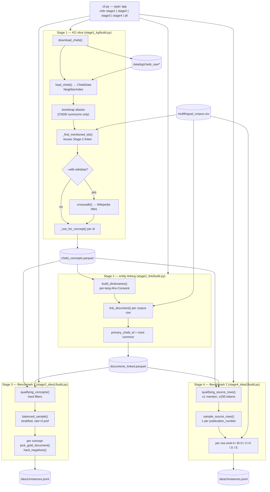
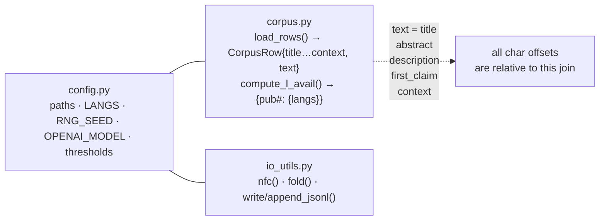
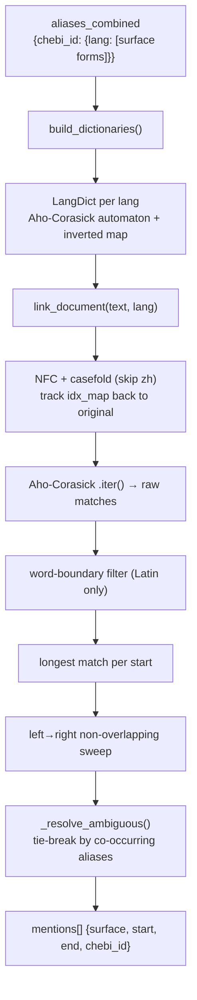
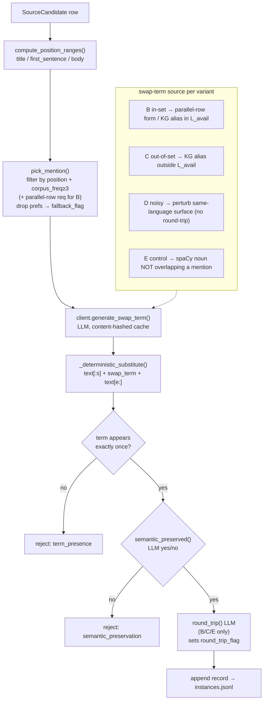

# Code Flow — `multilingual_doc_variants`

A four-stage, mostly-deterministic data-creation pipeline. Each stage reads the
artifact(s) the previous stage wrote and appends its own. Only stage 4 touches an
LLM.

---

## 1. Top-level pipeline (artifacts as the spine)

---

## 2. Shared foundation (used by every stage)

The concatenation order in `corpus.py` (`TEXT_FIELDS`) defines the coordinate
system: every `start`/`end` produced in stage 2 and every position range in
stage 4 is an index into this single joined string.

---

## 3. Stage 2 linker — the engine reused by Stages 1, 3 and 4

One concept gets the same `chebi_id` across languages **only because ChEBI's
`names.tsv.gz` already maps `catalyst`/`catalyseur`/`Katalysator` to the same
compound id.** There is no translation or alignment step — each language is a
fully independent monolingual scan.

---

## 4. Stage 4 inner loop — the only LLM path

LLM calls go through `LLMClient` → `LLMCache` (SHA-256 of the request payload,
appended to `idea2/llm_cache.jsonl`). Re-running stage 4 on the same rows is a
cache hit on every call → `$0` and deterministic.
